<div align="center">

# 💕 心灵奇旅 Soul

### AI 心理康复陪伴平台 · 本地优先 · 隐私友好 · 架构完整

[](#-项目简介)
[](#️-技术栈)
[](#️-技术栈)
[](#️-技术栈)
[](#-ai-能力与模型策略)
[](#-核心亮点)

**一个围绕 “感知 -> 评估 -> 干预 -> 复盘” 闭环构建的 AI 心理健康管理系统。**


[📖 项目简介](#-项目简介) • [✨ 核心亮点](#-核心亮点) • [🧩 功能模块](#-功能模块) • [🏗️ 系统架构](#️-系统架构) • [🚀 快速开始](#-快速开始) • [📸 界面预览](#-界面预览) • [📚 技术文档](#-技术文档)

</div>

---

## 📖 项目简介

**心灵奇旅（Soul）** 是一个面向大学生与年轻用户的本地化 AI 心理康复陪伴平台，融合了：

- 💬 智能对话
- 🧠 心理评估
- 🏋️ 训练指导
- 📝 情绪日记
- 💕 成长墙 / 成就系统
- 📊 数据分析

项目核心目标不是只做“会聊天的页面”，而是通过结构化记录、专业量表、训练干预、AI 分析和可视化反馈，形成一个完整的心理健康支持闭环。

### 🎯 项目定位

> 一个基于 `Next.js 16 + FastAPI + SQLite + Ollama / ModelScope` 构建的本地优先 AI 心理健康平台，强调隐私保护、业务闭环与工程完整性。


## ✨ 核心亮点

### 🌟 业务亮点

- **6 大核心模块闭环联动**：对话、评估、训练、日记、成长、分析彼此不是孤岛
- **结构化情绪记录**：日记不仅存文本，还存情绪、强度、触发事件、生活维度与 AI 反馈
- **游戏化成长表达**：爱心墙、连胜、翅膀、成就徽章让用户长期反馈更直观
- **可持续复盘**：年度数据分析支持查看情绪分布、趋势和训练/评估沉淀

### 🧠 AI / 架构亮点

- **SSE 流式聊天**：前端支持分块渲染、会话恢复、停止回答、危机提示
- **多阶段对话引导**：感性安慰 -> 理性引导 -> 问题解决
- **模型动态路由**：基于隐私、复杂度和危机检测，在本地模型与云端模型间切换
- **本地优先策略**：敏感内容优先走本地模型，降低隐私泄露风险
- **跨模块派生数据链路**：日记写入后自动同步成长记录、检测成就、进入分析报表

### 📦 一眼看懂这个项目

| 维度 | 当前能力 |
| --- | --- |
| 核心业务模块 | 6 个 |
| 心理评估量表 | 6 个 |
| 训练模板 | 12 个 |
| 情绪分类 | 12 类 |
| 成长墙 | 365 天可视化 |
| 对话协议 | SSE 流式输出 |
| 存储策略 | SQLite 本地持久化 |
| 模型策略 | Ollama 本地 + ModelScope 云端 |

---

## 🧩 功能模块

| 模块 | 作用 | 关键能力 |
| --- | --- | --- |
| 💬 智能对话 | 24 小时情绪陪伴 | 多轮对话、流式返回、危机检测、阶段式引导 |
| 🧠 心理评估 | 标准化心理测评 | PHQ-9、GAD-7、PSS-10、ISI、CD-RISC-10、LSAS-Brief |
| 🏋️ 训练指导 | 训练与干预 | 呼吸训练、正念冥想、认知重构、情绪调节、睡眠改善 |
| 📝 情绪日记 | 情绪记录与 AI 分析 | 模板引导、情绪强度记录、结构化输入、AI 反馈 |
| 💕 心灵奇旅之墙 | 成长可视化 | 365 天爱心墙、连胜、积极情绪、成就系统 |
| 📊 数据分析 | 年度复盘 | 情绪趋势、情绪分布、评估次数、训练时长、积极占比 |

### 💬 智能对话

- SSE 流式响应，边生成边展示
- 支持恢复当前活跃会话
- 支持中断回答与清空会话
- 内置危机关键词检测与紧急求助话术
- 支持本地模型与云端模型动态切换

### 🧠 心理评估

- 采用标准心理量表
- 自动评分、风险等级判断、结果解释、建议生成
- 支持历史记录与同量表趋势追踪
- 支持作答过程草稿自动保存与恢复

### 🏋️ 训练指导

- 6 大训练类型，12 个训练模板
- 支持训练详情、步骤引导、倒计时、暂停 / 继续
- 自动记录训练时长与用户反馈
- 支持统计训练分布与累计时长

### 📝 情绪日记

- 支持模板式引导与自由书写
- 记录多情绪与情绪强度
- 支持情绪触发事件与生活维度输入
- 写完后自动生成 AI 反馈与推荐内容

### 💕 成长墙 / 成就系统

- 365 天日历式成长记录
- 空心 / 粉心 / 翅膀心三态展示
- 自动计算连胜、积极占比、翅膀数量
- 自动检测并点亮成就徽章

### 📊 数据分析

- 按年聚合日记、评估、训练数据
- 展示核心指标、情绪趋势、情绪分布
- 支持从用户注册年份开始查看历史年度数据

---

## 🏗️ 系统架构

### 1. 整体架构图

```mermaid
flowchart TD
    U[用户浏览器] --> FE[Next.js 16 前端]
    FE --> API[统一请求层 apiFetch / apiRequest]
    API --> BE[FastAPI Router Layer]
    BE --> AUTH[/auth]
    BE --> CHAT[/chat]
    BE --> ASSESS[/assessments]
    BE --> TRAIN[/training]
    BE --> DIARY[/diary]
    BE --> GROWTH[/growth]
    BE --> ANALYTICS[/analytics]

    CHAT --> COORD[MultiAgentCoordinator]
    COORD --> PER[PerceptionPlanning]
    COORD --> PHASE[PhaseManager]
    COORD --> ROUTER[ModelRouter]
    ROUTER --> LOCAL[Ollama Local Model]
    ROUTER --> REMOTE[ModelScope Remote Model]

    ASSESS --> DB[(SQLite)]
    TRAIN --> DB
    DIARY --> DB
    GROWTH --> DB
    ANALYTICS --> DB
    CHAT --> DB
```

### 2. 架构设计重点

#### 前端

- 使用 `Next.js App Router` 组织页面
- 采用 **轻量基础层 + 页面自管理状态** 的方案
- 统一请求封装在 `src/lib/api.ts`
- 鉴权状态由 `localStorage + 未授权广播事件` 维护
- 聊天流式解析、日记 AI 反馈规范化等能力下沉到 `src/lib`

#### 后端

- `FastAPI + SQLAlchemy + SQLite`
- 路由按业务拆分：`auth / chat / assessments / training / diary / growth / analytics`
- 聊天链路由 `MultiAgentCoordinator` 做统一编排
- 模型路由由 `PerceptionPlanning + PhaseManager + ModelRouter` 共同决定

#### 数据层

- 事实表：`User / Conversation / Message / Diary / AssessmentRecord / TrainingRecord`
- 派生表：`GrowthRecord / Achievement`
- 模板表：`AssessmentTemplate / TrainingTemplate`

### 3. 核心链路：日记 -> 成长 -> 成就 -> 分析

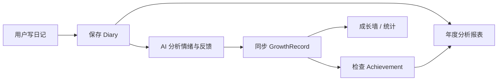

### 4. 核心链路：聊天 -> AI 编排 -> SSE 返回

```mermaid
flowchart LR
    A[前端发送消息] --> B[/api/chat/send]
    B --> C[创建/恢复 Conversation]
    C --> D[PerceptionPlanning: 隐私/复杂度/危机判断]
    D --> E[PhaseManager: emotional/rational/solution]
    E --> F[ModelRouter: 本地 or 云端]
    F --> G[模型流式生成]
    G --> H[SSE metadata/chunk/end]
    H --> I[前端增量渲染]
    G --> J[保存 assistant message]
```

---

## 🧱 项目结构

```text
.
├── frontend/
│   ├── src/app/                 # 各业务页面
│   ├── src/components/          # PageLoading / StatusBanner / ConfirmDialog 等
│   ├── src/hooks/               # useRequireAuth
│   └── src/lib/                 # 请求、鉴权、聊天流、日记工具
├── backend/
│   ├── app/main.py              # FastAPI 应用入口
│   ├── app/database.py          # SQLite / Session
│   ├── app/models.py            # ORM 模型
│   ├── app/schemas.py           # Pydantic Schema
│   ├── app/auth.py              # JWT 工具与当前用户依赖
│   ├── app/coordinator.py       # 聊天协调器
│   ├── app/perception_planning.py
│   ├── app/model_router.py
│   ├── app/phase_manager.py
│   └── app/routers/             # auth/chat/assessment/training/diary/growth/analytics
├── soul-project-architecture-interview-guide.md
└── frontend-interview-analysis.md
```

---

## 🛠️ 技术栈

### 前端

```text
Next.js 16 (App Router)
React 19
TypeScript 5
Tailwind CSS 4
Fetch API
React Markdown + remark-gfm
```

### 后端

```text
FastAPI
SQLAlchemy ORM
SQLite
JWT
Ollama
httpx
```

### 状态管理策略

采用轻量高效的状态管理方案：

- 页面状态：`useState / useEffect`
- 持久化状态：`localStorage`
- 鉴权广播：浏览器事件
- 服务端状态：后端数据库与 API 作为真源

---

## 🤖 AI 能力与模型策略

### 默认本地模型

- `qwen3:1.7b`

优点：

- 轻量
- 适合本地部署
- 隐私敏感内容可本地处理

### 云端模型

- `Qwen/Qwen3-Next-80B-A3B-Instruct`

适合：

- 更复杂的问题
- 需要更强推理的对话

### 路由策略

- **危机内容**：优先本地处理并触发危机提示
- **隐私内容**：强制本地模型
- **复杂内容**：优先云端模型
- **普通内容**：默认本地模型

### 可选本地模型

如果机器资源更充足，也可以尝试项目相关模型：

- [Qwen3-4B-soul（ModelScope）](https://www.modelscope.cn/models/Ethanwhh/Qwen3-4B-soul/summary)
- [Qwen3-4B-soul（Ollama）](https://ollama.com/Ethanwhh/Qwen3-4B-soul)

---

## 🚀 快速开始

### 环境要求

- `Node.js >= 18`
- `Python >= 3.10`
- 推荐安装 `uv`
- 推荐安装 `Ollama`

### 1. 克隆项目

```bash
git clone https://github.com/Ethanwhh/soul.git
cd soul
```

### 2. 配置后端环境变量

```bash
cp backend/.env.example backend/.env
```

建议至少配置以下变量：

```env
MODELSCOPE_API_KEY=your_api_key_here
MODELSCOPE_MODEL_NAME=Qwen/Qwen3-Next-80B-A3B-Instruct
OLLAMA_MODEL=qwen3:1.7b
```

说明：

- `OLLAMA_MODEL`：本地模型名称
- `MODELSCOPE_API_KEY`：用于复杂问题的云端模型调用
- 不配置 `MODELSCOPE_API_KEY` 时，复杂问题无法完整走云端增强链路

### 3. 启动 Ollama

```bash
ollama pull qwen3:1.7b
ollama serve
```

如果本地模型暂时不可用，部分功能会降级运行，但完整体验仍建议安装 Ollama。

### 4. 启动后端

```bash
cd backend
pip install uv
uv sync
uv run main.py
```

默认启动在：

- `http://127.0.0.1:8000`

### 5. 启动前端

```bash
cd frontend
npm install
npm run dev
```

默认启动在：

- `http://localhost:3000`

### 6. 可选：修改前端 API 地址

如需连接非默认后端地址，可在 `frontend/.env.local` 中配置：

```env
NEXT_PUBLIC_API_BASE_URL=http://127.0.0.1:8000
```

---

## 🧪 使用流程

```text
访问首页
  ↓
登录 / 注册
  ↓
进入 Dashboard
  ↓
选择六大业务模块中的任意一个开始使用
  ├─ 智能对话
  ├─ 心理评估
  ├─ 训练指导
  ├─ 情绪日记
  ├─ 心灵奇旅之墙
  └─ 数据分析
```

---

## 📸 界面预览

### 心灵奇旅介绍

> 项目简介 + 核心功能 + 设计理念

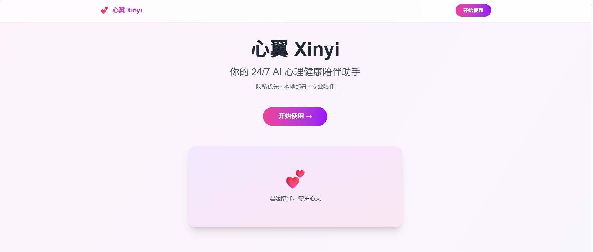
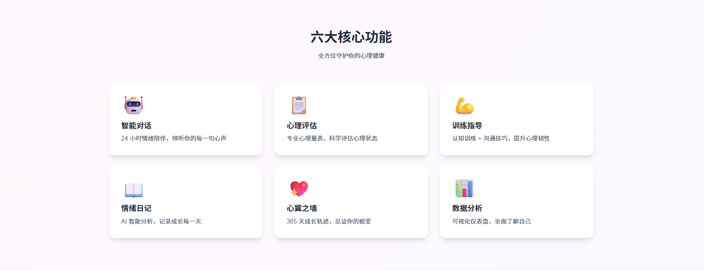
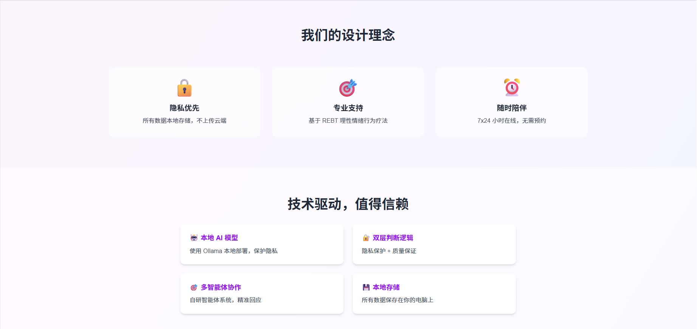

### 用户登录

> 新用户注册 + 老用户登录

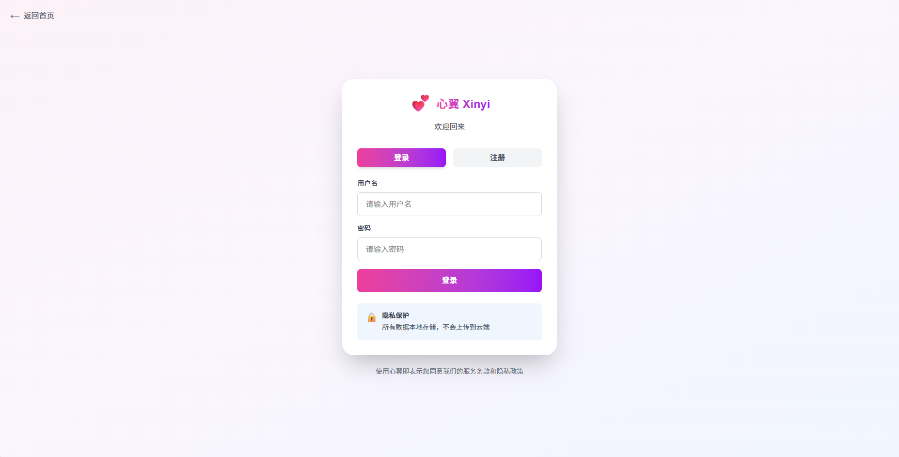

### 首页

> 六大功能统一入口

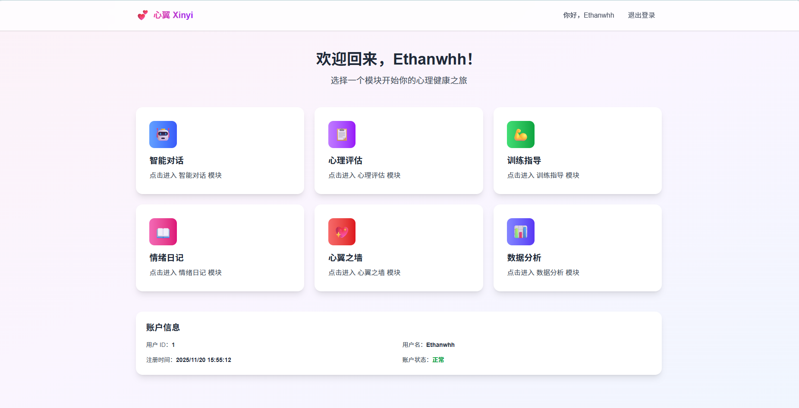

### 智能对话

> 流式响应 + 多轮对话 + 情绪陪伴

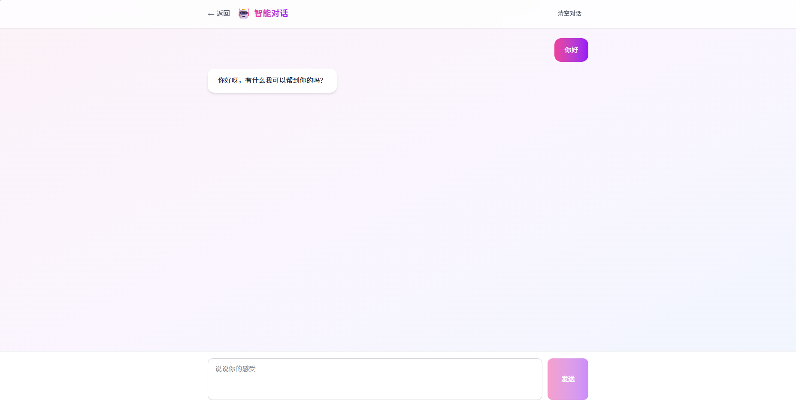

### 心理评估

> 标准量表 + 自动评分 + 历史趋势

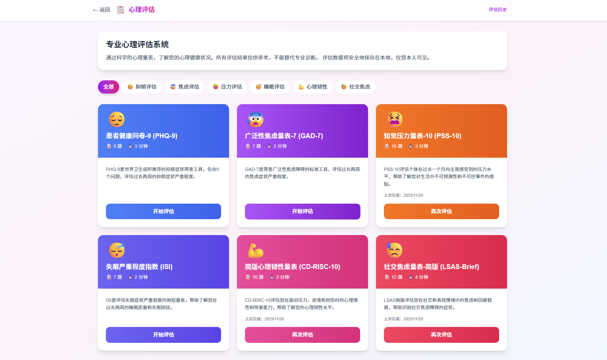

### 训练指导

> 训练详情 + 步骤引导 + 训练记录

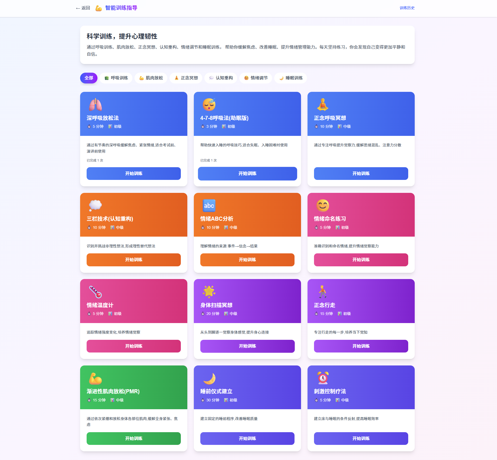

### 情绪日记

> 模板引导 + 结构化情绪记录 + AI 反馈

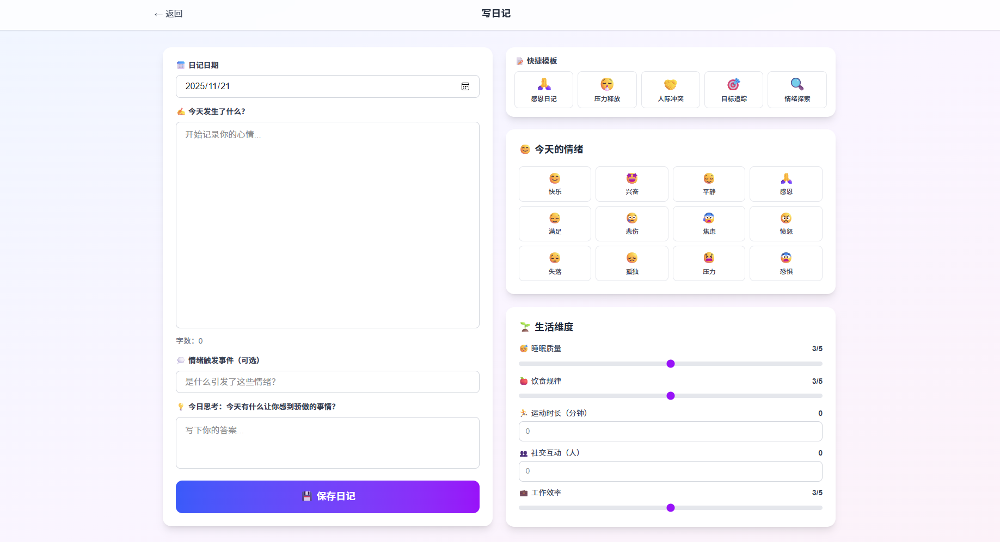

### 心灵奇旅之墙

> 爱心墙 + 连胜 + 成就系统

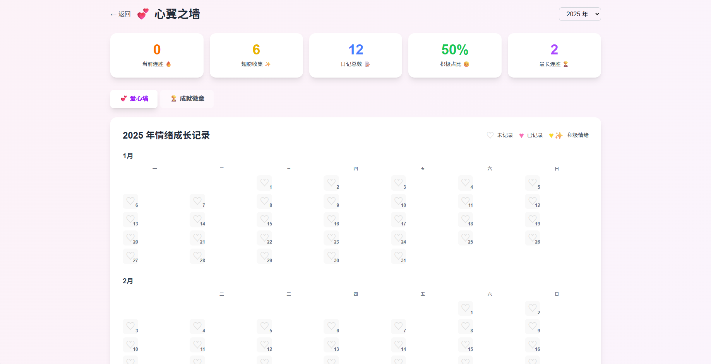

### 数据分析

> 核心指标 + 情绪趋势 + 情绪分布

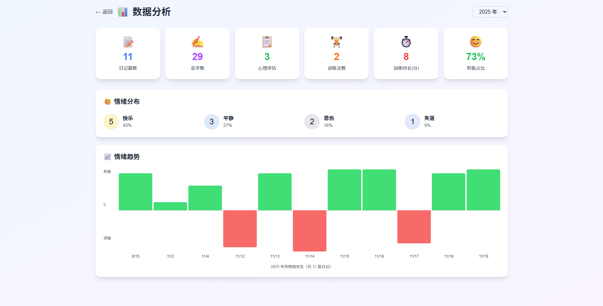

---

## 📚 技术文档

- [项目整体架构、状态管理与面试拆解](./soul-project-architecture-interview-guide.md)
- [前端面试分析文档](./frontend-interview-analysis.md)

如果你希望快速看懂项目，推荐阅读顺序：

1. `README.md`
2. `soul-project-architecture-interview-guide.md`
3. `frontend-interview-analysis.md`

---

## ⚠️ 限制与说明

- 本项目是 **心理健康辅助工具**，不能替代专业心理咨询和诊疗
- 评估结果仅供参考，不构成医学诊断
- AI 生成内容仅作辅助建议，不构成医疗建议
- 若用户存在自伤、自杀、暴力等风险，请及时寻求专业帮助

---

## 🙏 致谢

- [Qwen](https://www.modelscope.cn/models/Qwen/Qwen3-4B-Instruct-2507/summary)
- [SoulChat2.0](https://github.com/scutcyr/SoulChat2.0)
- [LLaMA-Factory](https://github.com/hiyouga/LLaMA-Factory)
- [Ollama](https://ollama.com/)
- [ModelScope](https://www.modelscope.cn/)

---

<div align="center">

**心灵奇旅 Soul**

愿技术不止解决问题，也能温柔地陪人走过一段路。

</div>
